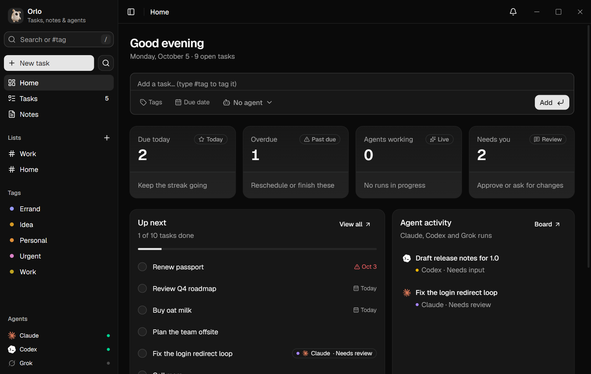
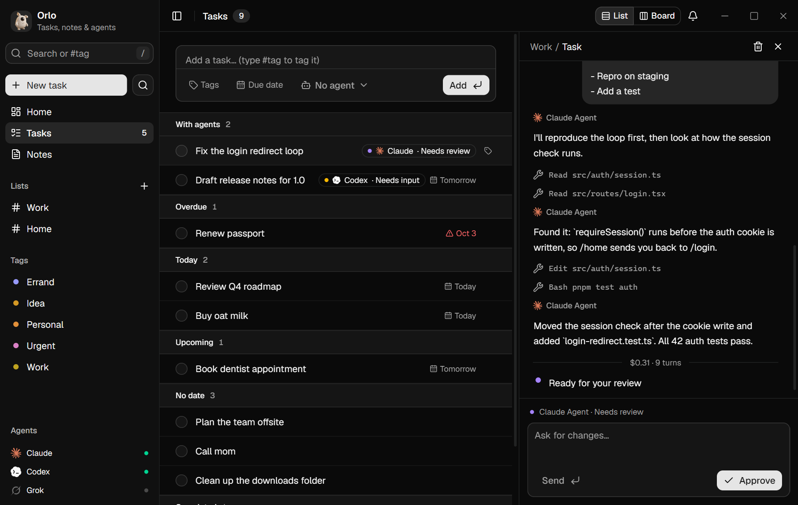
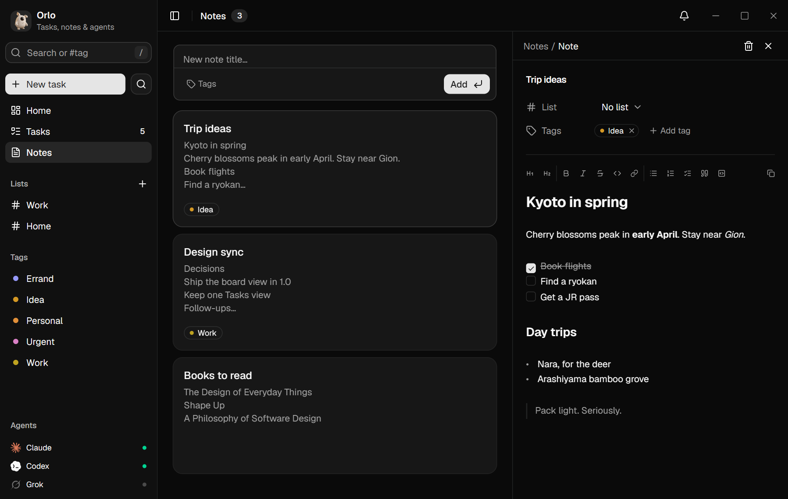
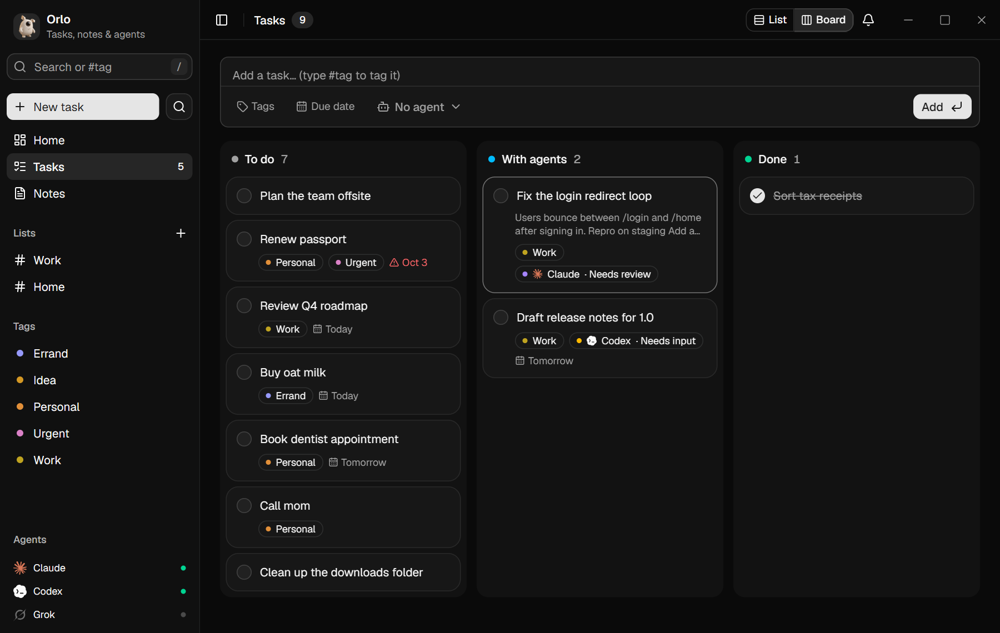
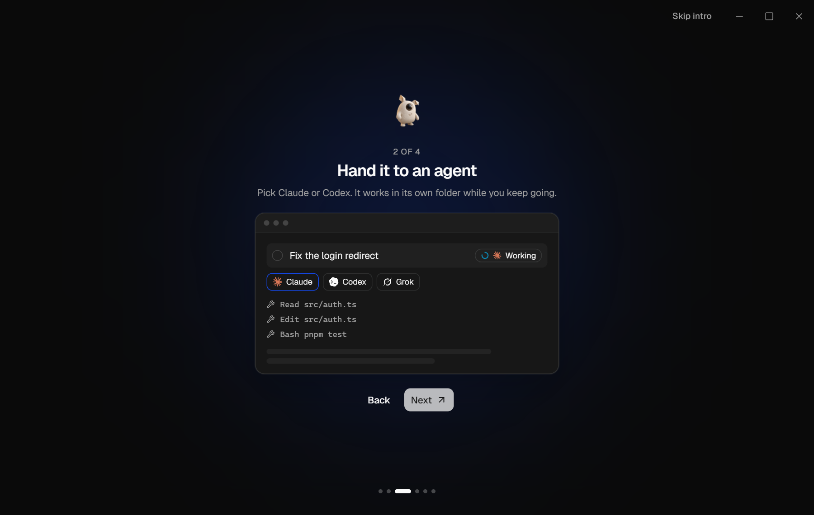

<div align="center">


# Orlo

**Tasks, notes and AI agents in one calm app for Windows and macOS.**

Write a task, hand it to Claude Code, Codex, Grok, Hermes or Gemini, then review and approve the result, all from your to-do list.

[Download for Windows or Mac](https://github.com/carbongotfound/orlo/releases/latest) · [Report a bug](https://github.com/carbongotfound/orlo/issues/new?template=bug_report.md) · [Contributing](CONTRIBUTING.md)



<a href="https://github.com/carbongotfound/orlo/releases/download/v1.1.0/Orlo-launch-film.mp4"></a>

🔊 **[Watch with sound](https://github.com/carbongotfound/orlo/releases/download/v1.1.0/Orlo-launch-film.mp4)**

</div>

## Features

- **Tasks:** one list with Overdue, Today, Upcoming and No date sections. Tasks you've handed to an agent sit at the top. Add lists, `#tags` and due dates, then switch between list and board. Rename a tag or pick its color from the tag's menu in the sidebar.
- **Dates as you type:** end a new task with `today`, `tomorrow`, `friday`, `next week` or `in 3 days` and it gets that due date.
- **Delegate to agents:** send a task to the `claude`, `codex`, `grok`, `hermes` or `gemini` CLI you already use. The agent works in its own folder, streams its progress into the task, and ends by reporting one of three outcomes: done, needs review or needs input.
- **Review loop:** reply to ask for changes, which resumes the same session. Approve to check the task off. Stop kills the run.
- **Markdown notes:**
  - Formatting appears as you type: `#` gives a heading, `-` a list, `- [ ]` a checklist and `>` a quote.
  - **Bold**, *italic*, `code` and links render inline too.
  - Copying always gives you the raw Markdown.
  - **Images and videos:** paste, drop or pick them with the image button. They show inline in notes and task descriptions, and the first image becomes the note's cover.
- **Code:** a small editor for your projects, with an agent beside it.
  - **Several projects** open at once as tabs along the top; each keeps its own files, terminal and conversation.
  - **Editor:** syntax highlighting, find and replace, multiple cursors, folding, bracket matching and word completion. <kbd>Ctrl</kbd>/<kbd>⌘</kbd>+<kbd>P</kbd> jumps to any file.
  - **Files:** right-click to create, rename, delete, copy a path or mention a file in the chat.
  - **Run** (<kbd>F5</kbd>) saves the open file and runs it in the terminal: Python, Node, TypeScript (via `tsx`), shell, PowerShell, Go, Ruby and more.
  - **Terminal** (<kbd>Ctrl</kbd>/<kbd>⌘</kbd>+<kbd>J</kbd>) runs one command at a time in the project folder. It isn't interactive, so commands that wait for input won't work.
  - **Changes:** for a git project, see every file changed since the last commit, read the diff and discard what you don't want. Handy right after an agent run.
  - **Agent chat** (<kbd>Ctrl</kbd>/<kbd>⌘</kbd>+<kbd>L</kbd> opens and closes it): talk to Claude, Codex, Grok, Hermes or Gemini about the project. Pick the model, reasoning effort and access level each agent supports. Conversations stay with the project and never show up as tasks. Replies continue the same session.
  - **Slash commands:** `/clear` starts a new conversation, `/model`, `/effort` and `/access` switch settings, `/stop` stops the run. The agent's own commands are listed too: Claude reports its commands (such as `/compact`) and Grok its own (`/compact`, `/context`, `/review` and more). `@` mentions a file.
- **Agents in the sidebar:** click one to see every task it has completed.
- **Notifications:** a bell inside the app plus a system notification with sound when an agent finishes, needs your review or needs an answer, and reminders for tasks that are overdue, due today or due tomorrow (while Orlo is open).
- **Agent CLI and skill:** agents (or you) can list, add and check off tasks from a terminal, and one command gives your agent a ready-made skill for it. See [Agent CLI](#agent-cli).
- **One window:** opening Orlo again brings the open window forward instead of starting a second copy.
- **Command menu:** <kbd>Ctrl</kbd>+<kbd>K</kbd> searches everything and runs any command.
- **Local-first:** everything lives in a SQLite file on your computer. There's no account, no server and no telemetry. The only request Orlo itself makes is the update check against GitHub releases.

| | |
|---|---|
|  |  |
|  |  |

## Install

1. Download from [Releases](https://github.com/carbongotfound/orlo/releases/latest):
   - `Orlo-<version>-windows-x64-setup.exe` installs Orlo for your user with a Start Menu shortcut.
   - `Orlo-<version>-windows-x64.exe` is the portable version: one file, nothing installed.
   - `Orlo-<version>-macos-universal.dmg` is for Macs (Apple silicon and Intel). Open it and drag Orlo to Applications.
2. The builds aren't code-signed:
   - **Windows** may show a SmartScreen warning. Click **More info → Run anyway**.
   - **macOS** may say Orlo "can't be opened" or "is damaged". Run `xattr -dr com.apple.quarantine /Applications/Orlo.app` once in Terminal, then open it.
   - Or build it yourself from source (see below).

**Updates:** Orlo checks GitHub for a new release at launch and every 6 hours, or when you pick **Check for updates** in the command menu (<kbd>Ctrl</kbd>+<kbd>K</kbd>). On Windows, click **Update** and it downloads the new exe, checks it against the SHA-256 that GitHub publishes for the release, swaps it in and restarts. On a Mac it tells you a new version is out, and you download the new dmg from Releases. Your data is untouched either way.

**Requirements:**
- Windows 10 or 11 (x64) with the [WebView2 runtime](https://developer.microsoft.com/microsoft-edge/webview2/). It's preinstalled on Windows 11.
- Or macOS 11 Big Sur or later.
- Agents are optional. To use one, install its CLI, sign in **in that CLI**, and make sure it's on your `PATH`:

| Agent | CLI | Sign in |
|---|---|---|
| Claude | [Claude Code](https://docs.anthropic.com/en/docs/claude-code) (`claude`) | run `claude`, then `/login` |
| Codex | [OpenAI Codex CLI](https://github.com/openai/codex) (`codex`) | `codex login` |
| Grok | `grok` CLI | run `grok` once and follow its prompts |
| Hermes | [Hermes Agent](https://github.com/NousResearch/hermes-agent) by Nous Research (`hermes`) | `hermes setup` |
| Gemini | [Gemini CLI](https://github.com/google-gemini/gemini-cli) (`gemini`) | run `gemini` once and sign in |

The agent list at the bottom of the sidebar shows which CLIs Orlo found. On a Mac, Orlo uses the `PATH` your login shell sets up, so CLIs installed with Homebrew or into `~/.local/bin` are found too.

## How Orlo works with agent CLIs

Orlo is an independent project. It is **not affiliated with, endorsed by or sponsored by Anthropic, OpenAI, xAI, Nous Research or Google.** It was designed to stay inside each provider's rules.

- **It only launches the official CLI you installed,** as you, on your own machine. That's the same as typing the command in a terminal. Each run gets its own folder, `~/Orlo/<task-id>` (`%USERPROFILE%\Orlo\<task-id>` on Windows), which you can change with `ORLO_WORK`.
- **It never touches credentials.** Orlo doesn't read, store, log, proxy or forward OAuth tokens, refresh tokens or API keys. It sets no auth environment variables and never opens the CLIs' credential files. Signing in happens only inside each CLI.
- **No shared accounts and no proxying.** Orlo is a local app for one person. Don't use it to share one subscription between several people, to resell access, or to run agents as a service for others. Those uses break the providers' terms.
- **The Code view is just an editor.** It reads and writes files on your disk and sends requests through the same official CLIs. It refuses to open the agents' sign-in folders (`.claude`, `.codex`, `.grok`, `.gemini`, `.hermes`) and other credential folders (`.ssh`, `.aws`, gcloud and gh config). It doesn't embed or imitate any provider's own coding product.
- **The CLI talks to its provider directly.** Orlo only reads the CLI's output and saves the run log in your local database.
- **You stay responsible for your usage** under each provider's terms:
  - Anthropic: [Consumer Terms](https://www.anthropic.com/legal/consumer-terms), [Commercial Terms](https://www.anthropic.com/legal/commercial-terms), [Usage Policy](https://www.anthropic.com/legal/aup)
  - OpenAI: [Terms of Use](https://openai.com/policies/terms-of-use), [Usage Policies](https://openai.com/policies/usage-policies)
  - xAI: [Terms of Service](https://x.ai/legal/terms-of-service)
  - Google: [Gemini CLI terms and privacy](https://github.com/google-gemini/gemini-cli/blob/main/docs/tos-privacy.md), [Gemini API Additional Terms](https://ai.google.dev/gemini-api/terms)
  - Hermes Agent ([MIT](https://github.com/NousResearch/hermes-agent/blob/main/LICENSE)) talks to whichever model provider you set up in `hermes setup`, so that provider's terms apply.

**What an agent is allowed to do.** Agents run commands with your user's permissions, so only delegate work you'd be happy to run yourself.
Pick the access level next to the model. Each agent offers only the levels its CLI supports:

| Agent | Access levels (first is the default) |
|---|---|
| Claude | **Edit files** (`--permission-mode acceptEdits --allowedTools Bash,Read,Edit,Write,Glob,Grep`) · Full access (`bypassPermissions`) · Plan only (`plan`) |
| Codex | **Full access** (`-s danger-full-access`, because its sandbox on Windows refuses every command when Orlo launches it) · Read only (`-s read-only`) |
| Grok | **Default** (Grok's own settings) · Accept edits · Auto-approve all (`--always-approve`) · Plan only |
| Gemini | **Full access** (`--yolo`) · Auto-approve edits (`--approval-mode auto_edit`) |
| Hermes | **Full access** (`--yolo`) |

- **Claude** also runs with `--max-turns 30 --max-budget-usd 1.50`.
- **Grok** takes a model (`grok-4.7`, `grok-4.7-build-fast`, `grok-4.6`, `grok-4.5`) and reasoning effort (low, medium, high), and replies resume the same Grok session.
- Nobody is there to answer approval prompts, so a level that would ask for approval refuses instead.
- **Every run** is stopped after 20 minutes. Stop ends it straight away, and closing Orlo ends any agent still running.

Claude, Codex, Grok, Hermes and Gemini names and logos are trademarks of their owners. They appear here only to show which tool a task uses. The logo artwork comes from [@lobehub/icons](https://github.com/lobehub/lobe-icons) (MIT).

## Keyboard

| Key | Action |
|---|---|
| <kbd>N</kbd> | New task |
| <kbd>/</kbd> | Search (`#tag` filters by tag) |
| <kbd>Ctrl</kbd>+<kbd>K</kbd> (<kbd>⌘</kbd>+<kbd>K</kbd> on Mac) | Command menu |
| <kbd>J</kbd> / <kbd>K</kbd> | Next / previous task |
| <kbd>Space</kbd> | Complete or reopen |
| <kbd>Enter</kbd> | Open details |
| <kbd>Del</kbd> | Delete (with undo) |
| <kbd>Esc</kbd> | Close panel |
| <kbd>Ctrl</kbd>+<kbd>B</kbd> / <kbd>I</kbd> / <kbd>E</kbd> | Bold, italic, inline code (in notes) |
| <kbd>Ctrl</kbd>+<kbd>Alt</kbd>+<kbd>1</kbd>–<kbd>3</kbd> | Heading 1–3 (in notes) |
| <kbd>Ctrl</kbd>+<kbd>P</kbd> / <kbd>S</kbd> / <kbd>F</kbd> | Go to file, save, find and replace (in Code) |
| <kbd>Ctrl</kbd>+<kbd>J</kbd> / <kbd>L</kbd> | Terminal, agent chat (in Code) |
| <kbd>F5</kbd> | Run the open file (in Code) |

On a Mac, use <kbd>⌘</kbd> where this table says <kbd>Ctrl</kbd>. Orlo shows the right key for your system everywhere.

## Agent CLI

The Orlo app is also a command-line tool, so any agent (Claude Code, Codex, a script) can pick up work from your list and file new work:

```sh
orlo tasks            # open tasks with the first line of each description (--all adds done ones)
orlo notes            # notes
orlo show 12          # one task or note in full
orlo add "Fix the login timeout" --notes "Happens on Safari only" --due 2026-10-12 --tag Work
orlo add "Standup ideas" --note --notes "..."
orlo append 12 "Done: rewrote the retry loop, tests pass."
orlo done 12          # check it off (Orlo picks this up when you switch back to it)
orlo reopen 12
orlo tasks --json     # tasks, notes and show also take --json
```

`orlo` is the Orlo app's own executable, so there's nothing extra to install.

**Teach your agent Orlo.** Pick **Copy Orlo skill for AI agents** in the command menu (<kbd>Ctrl</kbd>/<kbd>⌘</kbd>+<kbd>K</kbd>), or run `orlo skill`. You get a `SKILL.md` with the full path to Orlo on your machine, the commands, and when to use them. Then either:
- paste it into your agent's instructions (`AGENTS.md`, `CLAUDE.md`, a custom prompt), or
- save it as a Claude Code skill: `orlo skill > ~/.claude/skills/orlo/SKILL.md` (create the folder first).

On Windows the exe is a windowed app, so pipe its output when you run it in a terminal yourself (`orlo tasks | more`). Agents capture the output, so they don't need to.

## Your data

| What | Where |
|---|---|
| Tasks, notes, lists, agent logs | Windows: `%APPDATA%\com.orlo.app\orlo.db` · macOS: `~/Library/Application Support/com.orlo.app/orlo.db` (SQLite) |
| Agent work folders | `~/Orlo/<task-id>` (`%USERPROFILE%\Orlo\<task-id>` on Windows), or `ORLO_WORK` if set |
| Images and videos in notes | `attachments`, next to `orlo.db` |

To back up, copy the `.db` file and the `attachments` folder. To reset, delete them.

## Build from source

You'll need Node.js 20+, [pnpm](https://pnpm.io) and [Rust](https://rustup.rs). On Windows, Rust needs the MSVC toolchain (Visual Studio Build Tools with the C++ workload). On a Mac it needs the Xcode Command Line Tools (`xcode-select --install`).

```sh
pnpm install
pnpm tauri dev                  # run with hot reload
pnpm tauri build --no-bundle    # target/release/orlo.exe (or src-tauri/target/…)
pnpm tauri build --bundles app  # macOS: target/release/bundle/macos/Orlo.app
```

Built with [Tauri 2](https://tauri.app), React 19, TypeScript, Tailwind CSS v4, [shadcn/ui](https://ui.shadcn.com), [CodeMirror 6](https://codemirror.net) and SQLite.

## Contributing

Issues and pull requests are welcome. Start with [CONTRIBUTING.md](CONTRIBUTING.md), and see [SECURITY.md](SECURITY.md) for reporting vulnerabilities.

## License

[MIT](LICENSE)
